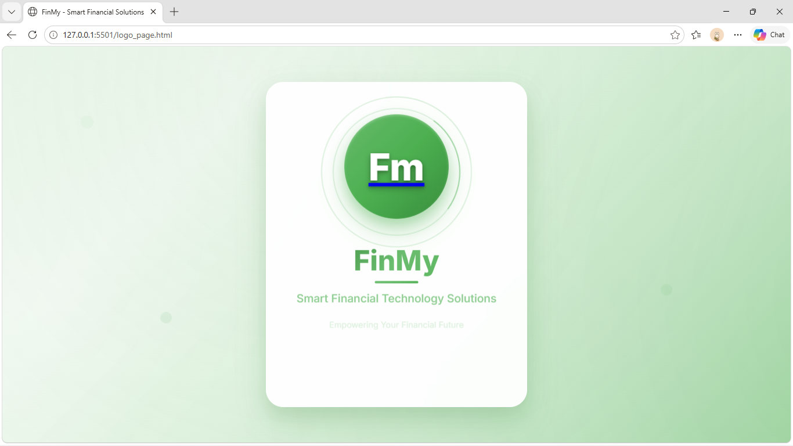
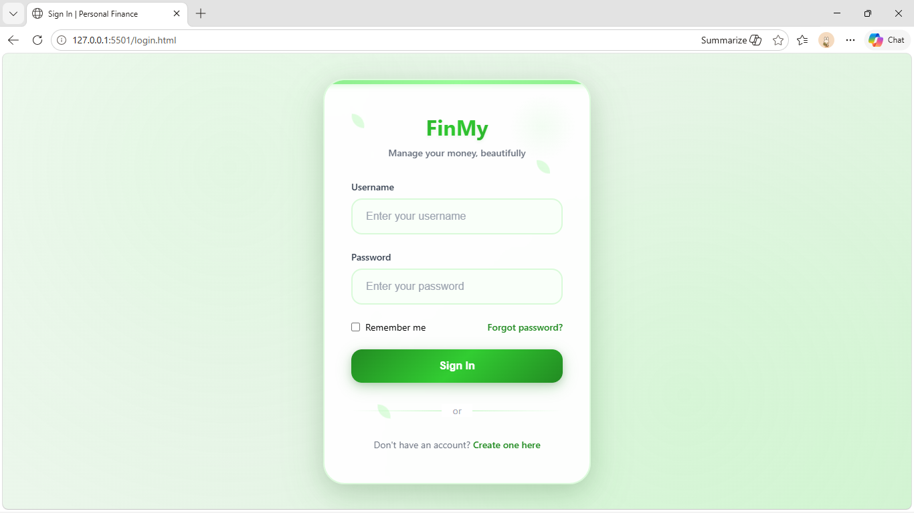
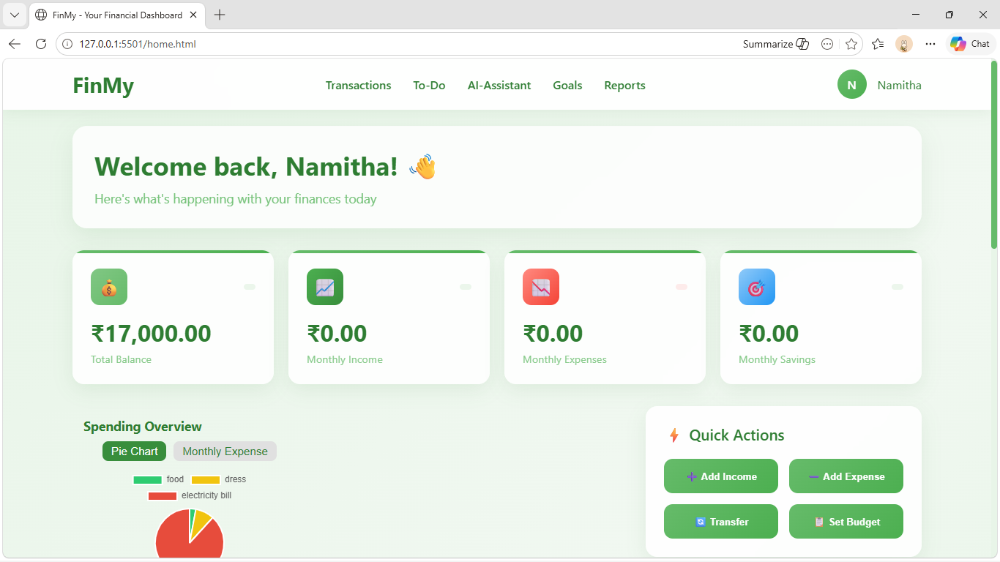
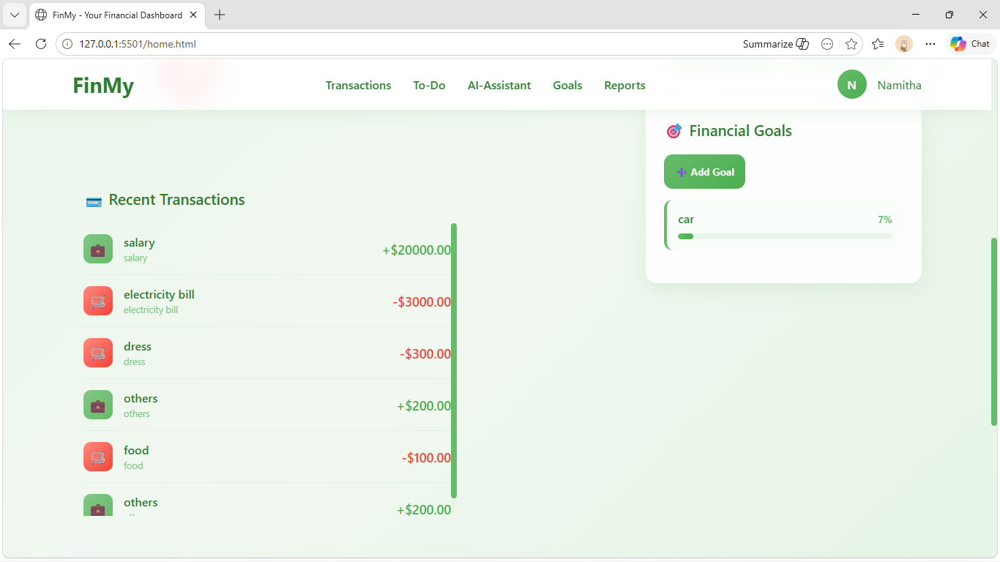
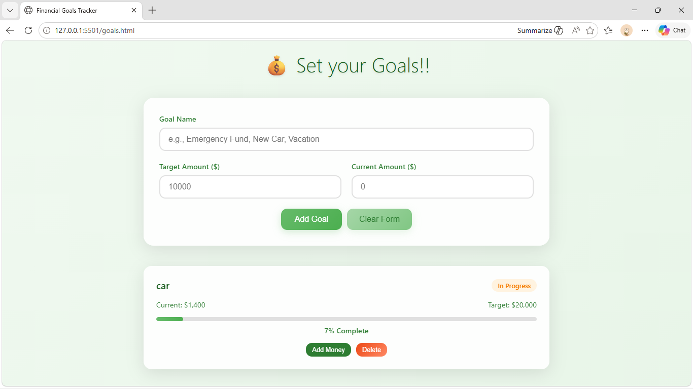
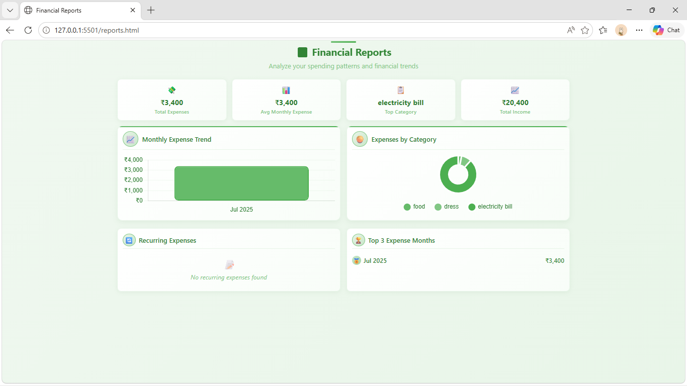
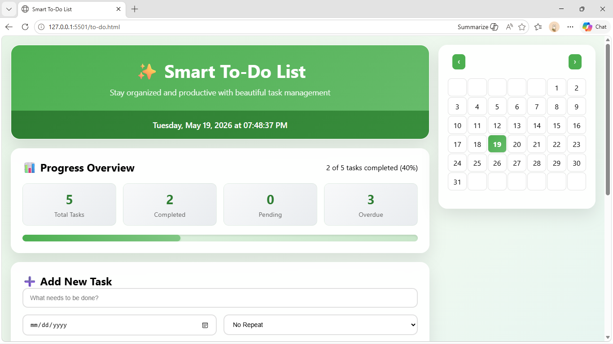
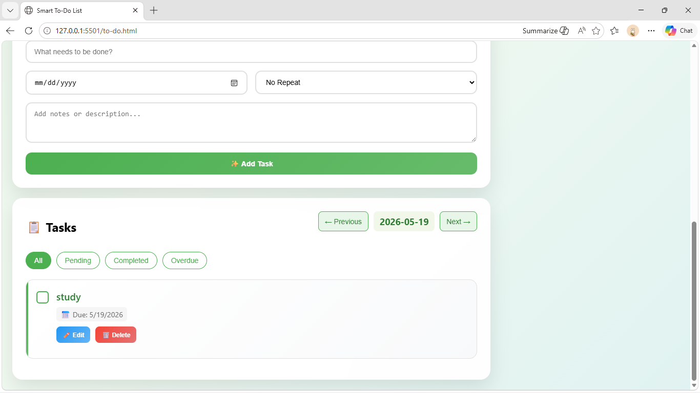

# 💰 FinMy - Personal Finance Tracker

FinMy is a modern and user-friendly personal finance management web application designed to help users manage their finances efficiently. The application provides features for tracking transactions, setting financial goals, analyzing spending patterns, managing tasks, and receiving AI-powered financial assistance.

---

## 🚀 Features

### 🔐 User Authentication

* User Registration
* Secure Login System
* Responsive Authentication Pages

### 📊 Dashboard

* Overview of financial activities
* Quick access to all modules
* Financial summary and insights

### 💳 Transaction Management

* Add income and expenses
* Track financial records
* Categorize transactions

### 🎯 Goal Tracking

* Create savings goals
* Monitor goal progress
* Track achievements

### 📈 Reports & Analytics

* Financial reports
* Spending analysis
* Expense tracking insights

### ✅ To-Do Manager

* Create and manage tasks
* Track completion status
* Organize financial activities

### 🤖 AI Finance Assistant

* Smart financial guidance
* Personalized suggestions
* Finance-related support

---

## 🛠️ Technologies Used

* HTML5
* CSS3
* JavaScript
* Local Storage
* Responsive Web Design

---

## 📸 Screenshots

### Landing Page



### Sign In Page



### Dashboard



### Transactions



### Financial Goals



### Reports



### To-Do Manager



### Add Task



---

## 📂 Project Structure

```text
FinMy
│
├── home.html
├── login.html
├── registration.html
├── transactions.html
├── goals.html
├── reports.html
├── to-do.html
├── ai_assistant.html
├── README.md
│
├── landing.png
├── sign_in.png
├── home.png
├── transactions.png
├── goals.png
├── Reports.png
├── to_do.png
└── add_task.png
```

---

## ⚙️ How to Run

1. Clone the repository

```bash
git clone https://github.com/NamithaTheresa/FinMy--personal-finance-tracker.git
```

2. Open the project in VS Code

3. Run the application using Live Server

4. Explore the various financial management features

---

## 🎯 Future Enhancements

* Firebase Authentication
* Cloud Database Integration
* Expense Prediction using AI
* Budget Planning Assistant
* Export Reports as PDF
* Mobile Application Support

---

## 👩‍💻 Author

**Namitha Theresa V J**

Computer Science Engineer 

---

## ⭐ Support

If you found this project useful, please consider giving it a star on GitHub.
